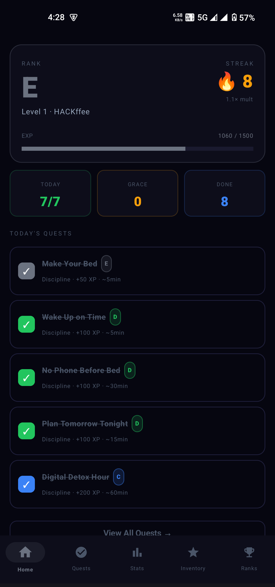
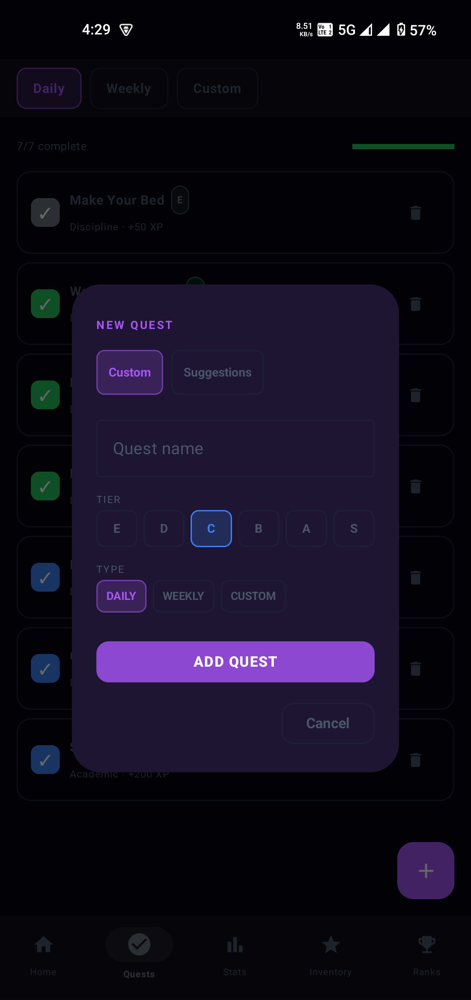
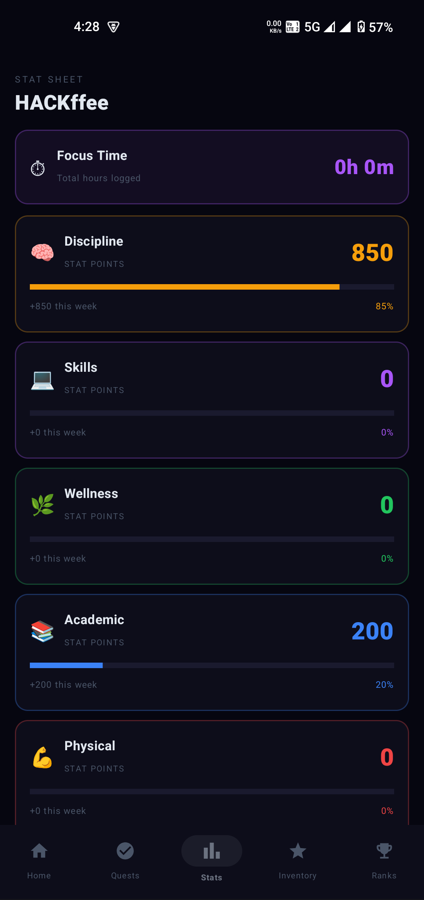
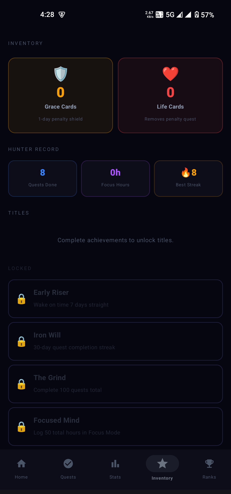

# SoloSystem ⚡

An offline-first, gamified productivity RPG tracker built natively for Android. Turn your daily routines, studies, and workouts into a leveling system with zero server latency and zero cost.

## 📸 App Preview

  
  
  
  

## 🚀 Features

* **Gamified Progression:** Earn XP, level up, and climb ranks based on real-life productivity.
* **Focus Mode Engine:** Built-in timer for deep work sessions.
* **Quest Library:** Daily, weekly, and custom quests across multiple stat types.
* **Offline-First:** No accounts, no cloud sync, no tracking.
* **Penalty System:** XP decay system to enforce consistency.
* **Reminders:** Daily notifications to maintain streaks.

## 🛠️ Tech Stack

* Kotlin
* Jetpack Compose
* Room Database
* WorkManager
* MVVM Architecture

## 📦 Installation

1. Download the APK
2. Install on Android device
3. Enable unknown sources if prompted

## 🛡️ License

Open-source and free to modify.
